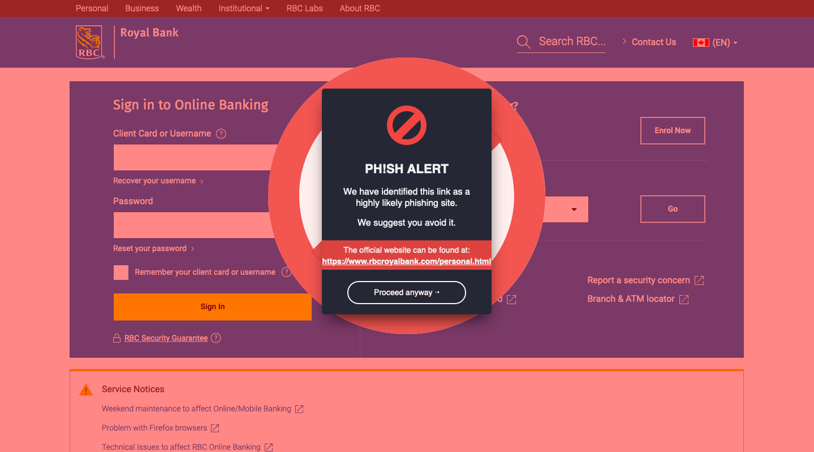

# ph!sh-demo
This is a repository written for the purposes of Ellehacks 2020.

The application is deployed at [http://www.rbcgroup.online](http://www.rbcgroup.online), and is meant to demonstrate the ability of a browser extension to detect a potential phishing attack and warn the user against entering personal information.

### An Example Screenshot

